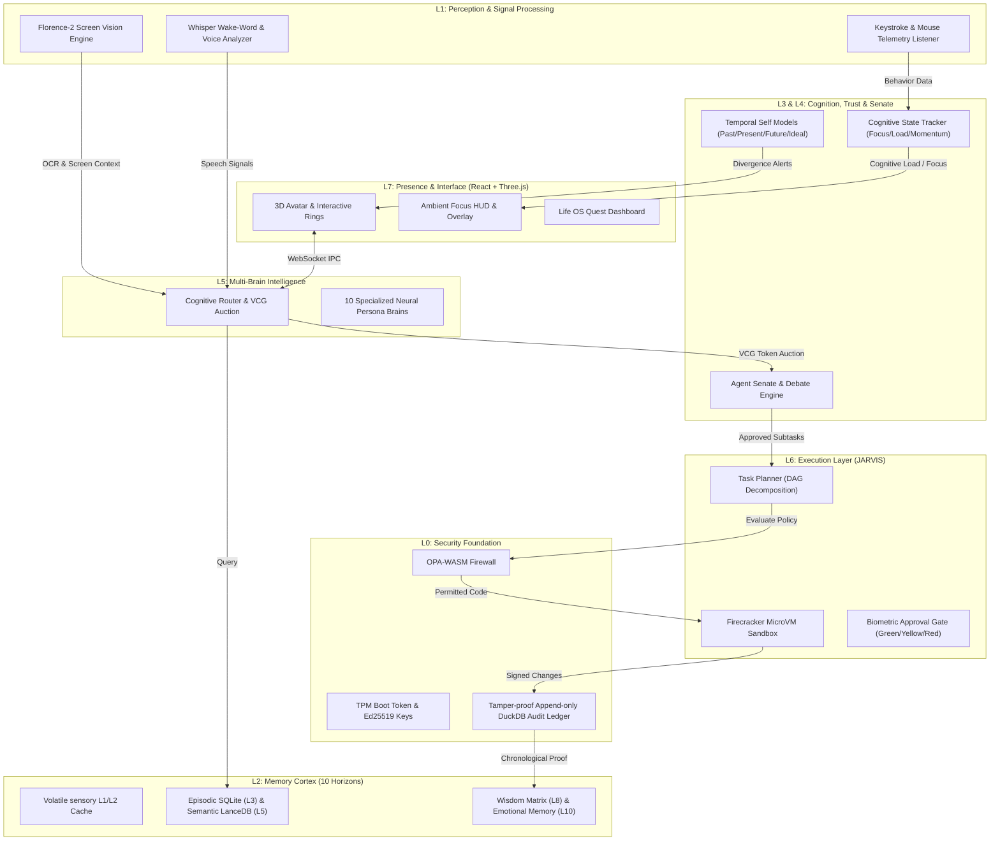

# 🌌 SOLOMON X — The Cognitive Presence System

[](https://github.com/theninthfoundry/solomon-x1)
[](https://github.com/theninthfoundry/solomon-x1)
[](LICENSE)
[](https://github.com/theninthfoundry/solomon-x1)
[](https://github.com/theninthfoundry/solomon-x1)

> **"Every AI system ever built waits for you. Solomon notices. That is the entire difference — and it changes everything."**

Project Solomon X is a local-first, zero-cloud-dependency **Persistent Cognitive Presence**—an agentic operating system designed to run alongside your life rather than just alongside your browser tabs. Over months and years of shared existence, Solomon evolves from a reactive assistant into an autonomous companion, and ultimately into your personal digital twin.

This repository implements the MVP foundation of Solomon's **8-Layer Cognitive Stack**, featuring an interactive Three.js 3D Ring interface representing the **Agent Senate**, a stateful memory cortex, real-time telemetry-driven cognitive trackers, and a cryptographically secured local execution bus.

---

## 🗺️ System Architecture

Solomon's architecture splits heavy cognitive processing (running locally in Python/Rust or securely connected to Gemini) from the hardware-accelerated user interface (Vite + React 19 + Three.js). Communication occurs over a cryptographically secured WebSocket bus verified with a session-scoped, TPM-sealed token.



---

## 🌟 Core Innovations & Paradigm Shifts

### 1. The Cognitive Symbiosis Index (CSI) 📈
Traditional AIs maintain zero self-metrics on their relationship depth. Solomon introduces the **CSI**, a dynamic $0\text{--}100\%$ score representing the depth of Solomon's alignment with you. It starts at $0\%$ (generic assistant) and advances toward $100\%$ (digital twin). As CSI increases, Solomon gains autonomy, adapting its tone, simplifying explanations, and executing Red-tier actions without requiring redundant prompts.

### 2. Memory DNA & The Forgetting Engine 🧬
Memories in Solomon are not flat vectors; they carry an 8-axis metadata helix:
$$\text{Memory DNA} = \langle \text{Importance}, \text{Valence}, \text{Confidence}, \text{Connectivity}, \text{Age}, \text{Focus State}, \text{Frequency}, \text{Contradiction} \rangle$$
The **Forgetting Engine** uses a log-damped, time-decaying Ebbinghaus retention function to prune low-reputation memory shards during sleep:
$$R_m(t) = \left( \alpha V_s + \beta \ln(1 + U_u) \right) \cdot e^{-\lambda t} \cdot (1 - C_r)$$
*Where $V_s$ is verification, $U_u$ is use frequency, $\lambda$ is decay rate, and $C_r$ is contradiction frequency.*

### 3. The Dream Cycle 🌙
When your PC goes idle (CPU $< 5\%$, user inactive for $> 15$ mins), Solomon enters **Dream Mode**. It schedules a four-stage nightly loop:
1. **Harvest**: Consolidates raw L3 episodic memories from the past 24 hours.
2. **Cluster**: Runs HDBSCAN spatial clustering on dense semantic vector embeddings.
3. **Synthesize**: Extracts core heuristics and converts clusters into structured Wisdom Cards.
4. **Morning Report**: Prepares a brief detailing connections between your projects, application logs, and relevant global market/code updates.

### 4. Temporal Self Integration ⏳
Solomon maintains four simultaneous models of you:
*   **Past-Self**: Archaeologies of historical decisions, outcomes, and emotional valence.
*   **Present-Self**: Real-time focus levels, active goals, and current stress metrics.
*   **Future-Self**: Probabilistic trajectory projections based on current productivity velocity.
*   **Ideal-Self**: Stated aspirational values and goals.
*When the divergence between your Future-Self and Ideal-Self passes a critical threshold, Solomon proactively intervenes.*

---

## 🪐 The Agent Senate: The 10 Rings of Solomon

Solomon's intelligence is distributed across ten specialized persona agents named after historical grimoire schemas. They coordinate, debate, and bid for context windows using the **Cognitive Resource Economy (CRE)**:

| Ring Index | Agent / Persona | Core Domain | Focus & Operational Instruction | Underlying LLM |
| :---: | :--- | :---: | :--- | :--- |
| **0** | **Ars Almadel** | `ORIGIN` | **Firewall Architect & Goal Guard:** Threat detection, securing system constraints, and enforcing OPA boundaries. | `Mistral-7B` / `Gemini` |
| **1** | **Ars Notoria** | `MEMORY` | **Memory Scribe:** Chronological episodic database writing, indexing concepts, and retrieving dense context. | `nomic-embed` + `Mistral` |
| **2** | **Ars Paulina** | `AWARENESS` | **Doubt Engine:** Analyzing epistemic uncertainty, calculating probabilities, and challenging cognitive biases. | `Qwen-72B` / `Gemini` |
| **3** | **Ars Goetia** | `KNOWLEDGE` | **Sandboxed Executor:** Safely executing system commands, running code scripts, and file manipulations. | `Qwen-Coder-7B` |
| **4** | **Ars Theurgia** | `CREATION` | **Reality Grapher:** Modeling goals as gravity vectors on a Lorentzian space manifold. | `Mistral-7B` |
| **5** | **Ars Almiras** | `SIMULATION` | **Cognitive Twin:** Logging focus, stress, and typing speed to trigger flow-state blocks. | `Custom Scikit-Learn` |
| **6** | **Ars Verum** | `EVOLUTION` | **Sovereignty Gatekeeper:** biometrics, authentication checks, and identity validation. | `Mistral-7B` |
| **7** | **Ars Ephesia** | `HARMONY` | **Dream Refiner:** Recompiling indices, garbage-collecting memory nodes, finding semantic correlations. | `Mistral-7B` / `Gemini` |
| **8** | **Ars Fulcanelli**| `TRANSCENDENCE`| **Temporal Auditor:** Verifying append-only DuckDB logs and cryptographically signing ledger state. | `Rust Daemon` |
| **9** | **Ars Regalis** | `GOVERNANCE` | **Sovereign Orchestrator:** Moderating debates, balancing the CRE budget, routing tasks. | `Gemini-3.5-Flash` |

---

## 🛠️ Technology Stack

### Frontend & UI Layer
*   **Vite + React 19 + TypeScript**: Scalable component-driven shell architecture.
*   **TailwindCSS v4**: Next-generation utility-first styling with hardware-accelerated animations.
*   **Three.js (WebGL/WebGPU)**: Renders the beautiful, orbital 3D rings and interactive particle spheres representing agent activity.
*   **GSAP & Motion (Framer Motion)**: Physics-bound UI micro-interactions, responsive panel shuffles, and card reputation drift.
*   **Recharts & Lucide React**: Analytics charts for the Cognitive Economy (CRE) and status icons.

### Local Compute & IPC Layer
*   **Python 3.11 (Asyncio)**: Powers the local WebSocket service (`brain.py`), coordinating multi-modal pipelines.
*   **Ollama Connection**: Native support for running quantised open-source models offline (Mistral-7B, Qwen-Coder).
*   **Google GenAI SDK**: Interfaces directly with the server-side Node gateway to stream `gemini-3.5-flash` tokens securely.
*   **AF_UNIX sockets / Local WebSockets**: Fast, low-overhead IPC communication between Electron/Node and Python processes.

### Data & Memory Cortex
*   **SQLite3 + SQLCipher**: Encrypted L3 episodic event databases.
*   **LanceDB**: Columnar vector storage for L5 semantic spaces and ANN queries.
*   **DuckDB**: Tamper-proof transaction logging and real-time analytical graph queries.

---

## ⚙️ Quickstart & Setup Guide

Ensure you have **Node.js (18+)**, **Python (3.9+)**, and **Ollama** installed on your system.

### 1. Clone & Install Dependencies
Clone the repository and install both npm packages and Python dependencies:

```bash
# Clone the repository
git clone https://github.com/theninthfoundry/solomon-x1.git
cd solomon-x1

# Install frontend dependencies
npm install

# Install python requirements
pip install -r requirements.txt
```

### 2. Configure Environment Secrets
Create a `.env` file in the root directory by copying the example template:

```bash
cp .env.example .env
```

Open `.env` and configure your API keys:
```env
# Required to unlock Gemini-backed Ring agents
GEMINI_API_KEY=your_gemini_api_key_here

# Used to secure the local WebSocket communication bus
SOLOMON_AUTH_TOKEN=your_secure_random_hex_string_here
```

### 3. Bootstrap Token (Optional - Production Simulation)
If running with the Rust binary or preparing security credentials, run the bootstrapper:
```powershell
# On Windows PowerShell (Admin)
.\scripts\bootstrap_token.ps1
```

### 4. Run the Dev Servers
Solomon runs on a dual-server mesh. Start them up in separate terminal windows:

#### Terminal 1: Python Cognitive Daemon (Local Models & Telemetry)
Make sure Ollama is running (`ollama serve`) in the background. Then launch:
```bash
python brain.py
```

#### Terminal 2: Node/Vite Express Server (Gemini Gateway & UI Server)
Launch the primary development gateway on port 3000:
```bash
npm run dev
```

Open your browser and navigate to `http://localhost:3000` to interact with the system.

---

## 🗺️ 12-Month Build Roadmap

### Phase 1: Foundation & Secure Bus (Month 1)
*   [x] Set up Monorepo directories & establish WebSocket event schemas.
*   [x] Build Node.js Express server to handle Gemini API Streaming Gateway.
*   [x] Establish secure handshake credentials (`SOLOMON_AUTH_TOKEN`).
*   [x] Build the initial Vite + React 19 UI with Three.js rendering the 10 Rings.

### Phase 2: Memory Cortex (Month 2)
*   [ ] Integrate SQLCipher to encrypt episodic logs locally.
*   [ ] Connect LanceDB to perform local fast embedding indexing via Ollama.
*   [ ] Design the Memory viewer UI to expose sliding episodic timelines.
*   [ ] Build the exponential Ebbinghaus memory decay scheduler.

### Phase 3: Cognitive State Engine & Emotion (Month 3)
*   [ ] Write OS-level typing dynamic trackers and mouse smoothness analyzers.
*   [ ] Train local scikit-learn classifiers on user-specific frustration and focus indicators.
*   [ ] Implement **Shadow Mode** (observational logging without intrusive active advice).
*   [ ] Program flow-state detection to silence notification overlays automatically.

### Phase 4: Execution Layer (Months 4-5)
*   [ ] Establish LangGraph DAG task planners.
*   [ ] Build Firecracker microVM isolates to safely sandbox system commands.
*   [ ] Implement plain-language execution previews and the DuckDB Audit Ledger.
*   [ ] Configure biometrically gated "Red Tier" approvals.

### Phase 5: Dream Engine & Reality Graph (Month 6)
*   [ ] Write nightly idle-state schedulers (CPU $< 5\%$).
*   [ ] Integrate HDBSCAN clustering for semantic association card generation.
*   [ ] Set up Lorentzian goal gravity vectors to calculate task priority curves.
*   [ ] Launch the Morning Intelligence Report email/dashboard.

### Phase 6: Avatar Customization & Gamified Life OS (Months 7-8)
*   [ ] Model ReadyPlayerMe / VRM avatars with 52-blendshape expressions.
*   [ ] Develop Rhubarb Lip-Sync mapping voice wave files to facial blendshapes.
*   [ ] Build the gamified Quest orbit nodes (XP reward loops, level indicators).
*   [ ] Deploy the 5 Presence Protocol modes (Desktop, Terminal, Ambient, Dream, Ghost).

### Phase 7: Agent Senate & VCG Economy (Months 9-10)
*   [ ] Create the VCG Auction engine for agent context bidding.
*   [ ] Program the Bayesian trust engine to evaluate conflicting memories.
*   [ ] Implement the internal Critic vs. Optimist debate mechanism on major decisions.
*   [ ] Build the Cognitive Immune System to counter adversarial prompt injection.

### Phase 8: Public Release & Community (Months 11-12)
*   [ ] Open-source the core architecture (MIT License).
*   [ ] Publish a technical research paper on arXiv.
*   [ ] Launch on HackerNews, ProductHunt, and submit to student tracks (CHI/UIST).

---

## 💡 Innovation Ideas to Explore

*   **Epistemic Immunization**: Create a local scanner that monitors your clipboard and browser history to build a Bayesian trust score for external web sources, highlighting misinformation before you read it.
*   **Dream-State Scaffolding**: Let Solomon spin up isolated code execution containers during the night to test different design iterations of your active projects, presenting you with working bug-fixes when you wake up.
*   **Affect-Indexed Search**: Retrace memory history by how you felt: *"Find the file I was working on when I was highly frustrated last Tuesday."*
*   **Multi-Agent VCG Auctions**: Expand the Cognitive Resource Economy (CRE) by letting rings trade computational credits based on their historical accuracy at resolving specific task classes.

---

## 📄 License
This project is licensed under the MIT License - see the [LICENSE](LICENSE) file for details.

---
*Solomon X: Your personal cognitive infrastructure platform. Built for minds, not machines.*
