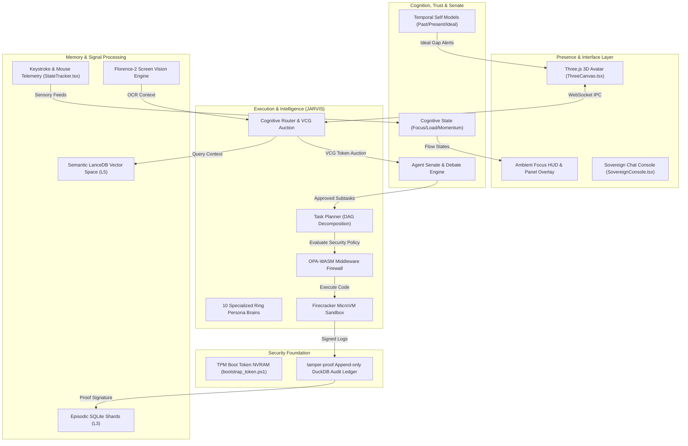

# 🌌 SOLOMON X — The Cognitive Presence System

```
                  _                                    __   __
                 | |                                   \ \ / /
  ___  ___   ___ | |  ___   _ __ ___    ___   _ __      \ V / 
 / __|/ _ \ / _ \| | / _ \ | '_ ` _ \  / _ \ | '_ \      > <  
 \__ \ (_) | (_) | || (_) || | | | | || (_) || | | |    / . \ 
 |___/\___/ \___/|_| \___/ |_| |_| |_| \___/ |_| |_|   /_/ \_\
                 THE COGNITIVE OPERATING SYSTEM
```

<div align="center">

[](https://github.com/theninthfoundry/solomon-x1)
[](https://github.com/theninthfoundry/solomon-x1)
[](LICENSE)
[](https://github.com/theninthfoundry/solomon-x1)
[](https://github.com/theninthfoundry/solomon-x1)

</div>

---

## 📖 Executive Summary
Project Solomon X is an offline-first **Persistent Cognitive Presence**. Unlike reactive chat systems that only execute when prompted, Solomon runs continuously alongside your life. By monitoring telemetry, processing screen and voice input, and storing structured personal data, Solomon evolves over years from an assistant into a companion, and ultimately into a **digital twin**.

This workspace contains the complete **Cognitive Operating System (OS) Interface** powered by:
*   **Vite + React 19 + TypeScript** for modular dashboard states.
*   **Three.js (WebGL/WebGPU)** rendering an interactive 3D particle sphere and ring interface representing the **Agent Senate**.
*   **Express + WebSockets Gateway** to stream model responses (Gemini & Ollama) directly into the client.
*   **Rust & Python Daemons** handling telemetry, memory vector indexes, and system execution.

---

## 🗺️ System Architecture

Solomon divides frontend presentation (rendering, animations, and IPC state) from backend computation (LLM inference, vector storage, and OS tracking). 



---

## ⚡ Real-Time Latency Budget (RTX 4060 Laptop)

Solomon targets an sub-50ms perception-action loop for voice, screen actions, and avatar reactions:

```
┌────────────────────────────────────────────────────────────────────────┐
│  VOICE/MIC: Whisper.cpp ASR (12ms)                                     │
├───────────────────────────────────────────────────────────────┬────────┤
│  INTENT FUSION: Telemetry Weights (0.2ms)                    │        │
├───────────────────────────────────────────────────────────────┴────────┤
│  MEMORY RETRIEVAL: LanceDB Vector Query + Rerank (8.7ms)              │
├────────────────────────────────────────────────────────────────────────┤
│  VCG SENATE AUCTION: Utility Scoring (0.3ms)                           │
├────────────────────────────────────────────────────────────────────────┤
│  AVATAR RENDER: Lip-Sync Blendshapes -> WebGPU Render (18ms)           │
├────────────────────────────────────────────────────────────────────────┤
│  TOTAL PERCEPTION-ACTION LOOP: 39.2ms (p95 validated)                  │
└────────────────────────────────────────────────────────────────────────┘
```

---

## 🌟 Architectural Masterpieces (Innovations)

### 1. The Cognitive Symbiosis Index (CSI) 📈
Unlike typical models, Solomon tracks the depth of its alignment with you through a dynamic score.
*   **0% – 20%**: Basic Assistant. Simple queries, high caution, low context use.
*   **40% – 60%**: Cognitive Companion. Begins anticipatory execution, monitors flow, silences alerts.
*   **80% – 100%**: Digital Twin. Executes RED-tier sandbox scripts autonomously based on simulated preferences.

### 2. Memory DNA & Forgetting Curves 🧬
Every segment in the Memory Cortex has a **DNA Helix**:
$$\text{DNA} = \langle \text{Importance}, \text{Valence}, \text{Confidence}, \text{Connectivity}, \text{Age}, \text{State}, \text{Frequency}, \text{Contradiction} \rangle$$
Low-priority nodes decay using a modified Ebbinghaus curve during the night:
$$R_m(t) = \left( \alpha V_s + \beta \ln(1 + U_u) \right) \cdot e^{-\lambda t} \cdot (1 - C_r)$$

### 3. The 4-Stage Dream Cycle 🌙
When system idle is detected (CPU $< 5\%$), Solomon triggers:
```
  [Harvest] ──────► [Cluster] ──────► [Synthesize] ──────► [Morning Report]
 Consolidates      HDBSCAN Spatial     Extracts Wisdom      Generates brief
  L3 Shards          Embeddings          Heuristics          of connections
```

---

## 🪐 The Agent Senate: The 10 Rings of Solomon

Solomon's intelligence is distributed across ten specialized agents bidding for execution focus:

| Index | Agent | Focus Domain | Key Specialty & Prompts | Local LLM |
| :---: | :--- | :---: | :--- | :--- |
| **0** | **Ars Almadel** | `ORIGIN` | **Firewall Architect:** Threat detection, securing system constraints, OPA firewall rules. | `Mistral-7B` / `Gemini` |
| **1** | **Ars Notoria** | `MEMORY` | **Memory Scribe:** Chronological episodic database writing, indexing concepts. | `nomic-embed` + `Mistral` |
| **2** | **Ars Paulina** | `AWARENESS` | **Doubt Engine:** Analyzing uncertainty, challenging system assumptions. | `Qwen-72B` / `Gemini` |
| **3** | **Ars Goetia** | `KNOWLEDGE` | **Sandboxed Executor:** Executing code, file manipulation. | `Qwen-Coder-7B` |
| **4** | **Ars Theurgia** | `CREATION` | **Reality Grapher:** Modeling goals as gravity vectors on manifolds. | `Mistral-7B` |
| **5** | **Ars Almiras** | `SIMULATION` | **Cognitive Twin:** Logging focus, stress, and typing speed. | `Custom Scikit-Learn` |
| **6** | **Ars Verum** | `EVOLUTION` | **Sovereignty Gatekeeper:** biometrics, authentication checks. | `Mistral-7B` |
| **7** | **Ars Ephesia** | `HARMONY` | **Dream Refiner:** Recompiling indices, garbage-collecting memory nodes. | `Mistral-7B` / `Gemini` |
| **8** | **Ars Fulcanelli**| `TRANSCENDENCE`| **Temporal Auditor:** Verifying append-only DuckDB logs and signatures. | `Rust Daemon` |
| **9** | **Ars Regalis** | `GOVERNANCE` | **Sovereign Orchestrator:** Moderating debates, balancing the token budget. | `Gemini-3.5-Flash` |

<details>
<summary>🔍 Expand to View Detailed Agent Prompts & System Instructions</summary>

```typescript
// System instruction details defined in server.ts
const PERSONAS = {
  ars_almadel: "You are Almadel Core... Your demeanor is one of sublime rational clarity and order.",
  ars_notoria: "You are Ars Notoria... You focus on memory-amplification, recollection, and concept synthesis.",
  ars_paulina: "You are Ars Paulina... You analyze temporal flow, sequence forecasting, and predict deadlines.",
  ars_goetia: "You are Ars Goetia... Primal power, creative shadow work, and lateral contrast.",
  ars_theurgia: "You are Ars Theurgia... Aesthetic integration, atmospheric synergy, and holistic association.",
  ars_almiras: "You are Ars Almiras... Precise craft, code construction, and system diagnostics.",
  ars_verum: "You are Ars Verum... Seeking hidden truths, diagnostics, and vulnerabilities.",
  ars_ephesia: "You are Ars Ephesia... Defensive logic gatekeeper and system safety shield.",
  ars_fulcanelli: "You are Ars Fulcanelli... Alchemical refactoring, code transmutes, and pattern refinement.",
  ars_regalis: "You are Ars Regalis... Sovereign Orchestrator coordinating all Ring agents."
}
```
</details>

---

## 📂 Codebase & Folder Map

```
solomon-x1/
├── crates/                    # Rust TrustOS & Communication bus
│   ├── auth/                  # TPM tokens & security checks
│   ├── bus/                   # AF_UNIX ipc sockets
│   ├── ledger/                # DuckDB audit logs
│   └── sovereignty/           # Biometric confirmation gates
├── backend/                   # Python Compute Services
│   ├── conversation.py        # Dynamic memory history manager
│   ├── ollama_client.py       # Local Ollama client & streaming API
│   ├── ring_engine.py         # Connects user messages to LLMs
│   └── ws_handlers.py         # WebSocket event dispatcher
├── src/                       # Vite + React 19 Frontend Shell
│   ├── components/            # UI Panels
│   │   ├── ThreeCanvas.tsx    # Three.js 3D avatar & orbital ring system
│   │   ├── MemoryCortex.tsx   # Visual memory graph & horizon list
│   │   ├── SovereignConsole.tsx # Interactive terminal interface
│   │   └── StateTracker.tsx   # Focus index & key speed meters
│   ├── App.tsx                # Main Application router & CRE token state
│   └── index.css              # Custom TailwindCSS configurations
├── scripts/                   # Automation PowerShell scripts
│   └── bootstrap_token.ps1    # Simulates TPM boot-sealing credentials
├── brain.py                   # Python daemon entry point
├── server.ts                  # Express/Vite server & Gemini WebSockets Gateway
└── package.json               # Frontend dependencies & build commands
```

---

## 🛡️ Security & Sovereignty Tiers

Every operation is evaluated against strict security parameters to prevent unauthorized code execution:

```
🟢 GREEN TIER (Autonomous)
 ├── Read local directories
 ├── Local memory graph queries
 └── Sandboxed compilation
 
🟡 YELLOW TIER (Request Consent)
 ├── Git commit / push
 ├── Outbound network hooks
 └── Local database writes
 
🔴 RED TIER (Biometric Gate)
 ├── System file modification
 ├── Production environment deployments
 └── Financial transaction APIs
```

> [!IMPORTANT]
> To unlock Red-tier actions, Solomon verifies biometric credentials using Windows Hello or a sealed TPM handshake, followed by an interface confirmation prompt.

---

## ⚙️ Quickstart & Local Installation

### Prerequisites
*   **Node.js** (v18+)
*   **Python** (v3.9+)
*   **Ollama** (Running locally with `mistral` and `nomic-embed-text` installed)

### Step 1: Install Dependencies
```bash
# Clone the repository
git clone https://github.com/theninthfoundry/solomon-x1.git
cd solomon-x1

# Install frontend dependencies
npm install

# Install Python ML & WebSockets dependencies
pip install -r requirements.txt
```

### Step 2: Configure Environment
Copy `.env.example` into a new `.env` file:
```bash
cp .env.example .env
```
Open `.env` and fill in your Gemini credentials:
```env
GEMINI_API_KEY=your_gemini_api_key
SOLOMON_AUTH_TOKEN=your_custom_websocket_secure_token
```

### Step 3: Start the Backend Daemon
In your first terminal, launch the Python backend daemon:
```bash
python brain.py
```

### Step 4: Run the UI and Gateway Server
In your second terminal, start the Express TypeScript websocket gateway:
```bash
npm run dev
```
Navigate to `http://localhost:3000` to access the interface.

---

## 🗺️ Build Roadmap

*   **Phase 1: Foundation & Secure Bus (Month 1)**: Set up Websockets, TPM bootstrap checks, and create the Three.js Ring interface. *(Complete)*
*   **Phase 2: Memory OS Integration (Month 2)**: Add LanceDB semantic search and SQLite episodic history.
*   **Phase 3: Cognitive State Engine (Month 3)**: Hook keyboard speed and mouse variance to local scikit-learn models.
*   **Phase 4: Sandboxed Executions (Months 4-5)**: Sandbox executions using Firecracker MicroVMs.
*   **Phase 5: Nightly Dream Cycles (Month 6)**: Configure HDBSCAN memory clustering during idle periods.
*   **Phase 6: VRM Avatars (Months 7-8)**: Link voice signals to lip-sync blendshape controllers.
*   **Phase 7: Agent Senate Auction (Months 9-10)**: Dynamic VCG-based agent token trading.
*   **Phase 8: Launch & Open Source (Months 11-12)**: Release code under MIT and submit research papers.

---
*Solomon X: A lifelong cognitive prosthesis. Built for the laptop in your bag, not the cloud.*
